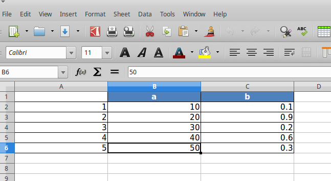
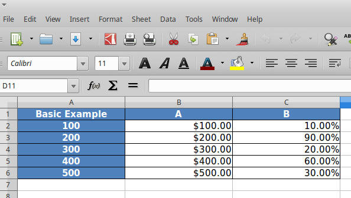
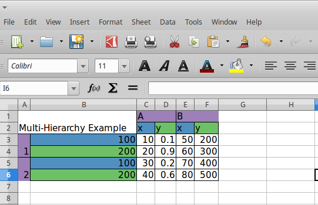
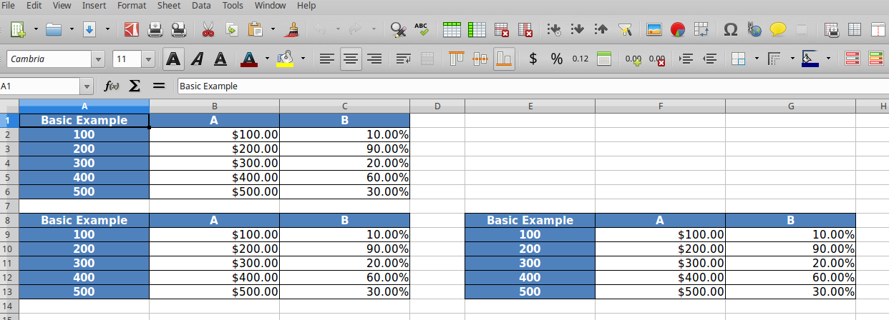
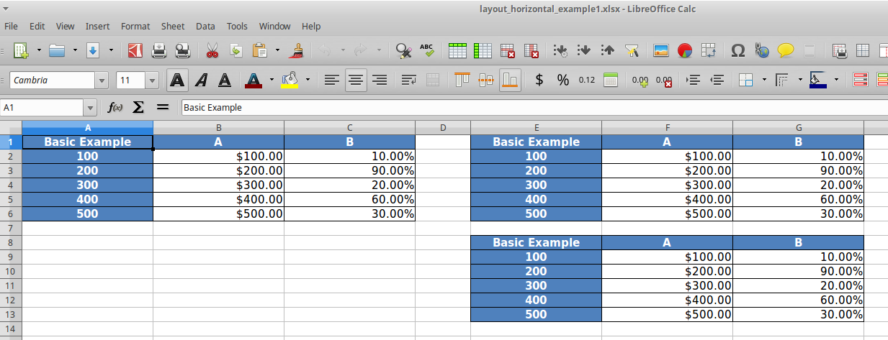
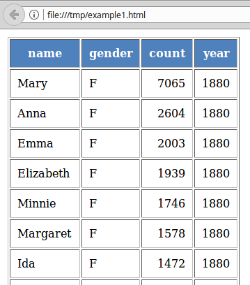
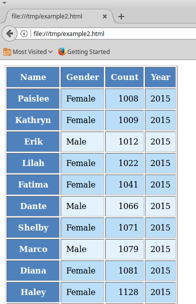
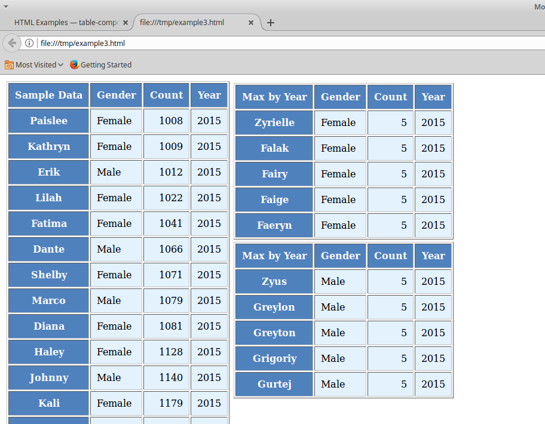
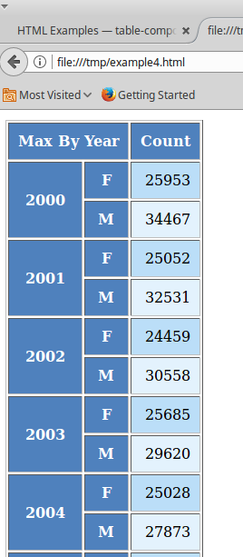

.. image:: https://travis-ci.org/InvestmentSystems/table-compositor.svg?branch=master
    :target: https://travis-ci.org/InvestmentSystems/table-compositor

.. image:: https://readthedocs.org/projects/table-compositor/badge/?version=latest
    :target: https://table-compositor.readthedocs.io/en/latest/?badge=latest

.. image:: https://badge.fury.io/py/table-compositor.svg
   :target: https://badge.fury.io/py/table-compositor

table-compositor
=================

The table-compositor library provides the API to render data stored in table-like data structures. Currently the library supports rendering data available in a Panda's DataFrames. The DataFrame layout is used as the table layout(including single and multi hierarchical columns/indices) by the library. The table layout is rendered directly on to an XLSX sheet or to a HTML page. Styling and layout attributes can be used to render colorful XLSX or HTML reports. The library also supports rendering of multiple dataframes into a single XLSX sheet or HTML page. The objective of the library is to be able to use the DataFrame as the API to configure the style and layout properties of the report. Callback functions are provided to customize all styling properties. The nice thing about the callback functions are that the style properties are set on cells indexed with index/column values available in the original dataframe used during rendering.

Hello World of Reports
=======================

The purpose of this library is to use the Pandas DataFrame as an
interface to represent the layout of a table that needs to be rendered
to an xlsx file or as an html table. The library abstracts away the
tedious work of working at the cell level of an xlsx sheet or a html
table. It provides a call-back mechanism by which the user is able to
provide values that need to be rendered and also the styling that needs
to be used for each cell in the rendered table. The library is also
capable of laying out multiple tables in the same sheet which are evenly
spaced vertically or horizontally based on the layout configuration
provided.

A Hello World Example: Dataframe to Xlsx
----------------------------------------

Every use of this library involves four steps.

1. We build a dataframe that resembles the shape of the table that will
   be rendered.
2. The dataframe is passed as an argument to the function called
   ``build_presentation_model``. This function accepts a dataframe and
   also a number of functions as arguments. We call the value returned
   by this function, the presentation_model.
3. Create a layout of multiple presentation models (if we want more than
   one table rendered in same xlsx sheet or same html page)
4. Call the render_xlsx or render_html functions on the respective
   writers, OpenPyxlCompositor or XlxsWriterCompositor for xlxs and HTMLWriter for HTML output.

A Quick Look at a Xlsx example
~~~~~~~~~~~~~~~~~~~~~~~~~~~~~~

We will start with a simple dataframe and render the dataframe as is to
an xlsx file

.. code:: python

   import pandas as pd
   from table_compositor.table_compositor import build_presentation_model
   from table_compositior.xlsx_writer import OpenPyxlCompositor

   sample_df = pd.DataFrame(dict(a=[10, 20, 30, 40, 50], b=[0.1, 0.9,0.2, 0.6,0.3]), index=[1,2,3,4,5])

   # create a presentation model
   presentation_model = build_presentation_model(df=sample_df)

   # create a layout, which is usually a nested list of presentation models
   layout = [presentation_model]

   # render to xlsx
   output_fp = '/tmp/example1.xlsx'
   OpenPyxlCompositor.to_xlsx(layout=layout, output_fp=output_fp)

Running this code produces the following output:

In the above code snippet, we first created a dataframe called
``sample_df``.

To render this dataframe, we first invoke build_presentation_model. The
build_presentation_model accepts the dataframe as its first argument. In
this example, we use the defaults provided by this method for all other
arguments. The build_presentation_model returns an presentation_model
object.

Before we call XlSXWriter.to_xlsx we create a layout. A layout is a
nested list of presenation_models. In our case, since we have only one
presentation_model we create a list with a single element. Later on when
we work with multiple presentation models that need to be rendered on to
the same sheet, we could create nested list such as
[[model1, model2], [model3]] etc.

.. raw:: html

    

    <h2>Building the Presentation Model<a class="headerlink" href="#building-the-presentation-model" title="Permalink to this headline">¶</a></h2>
    
The <cite>build_presentation_model</cite> function is the most important interface in this library. This function exposes all the functionality that is required to render beautiful looking excel worksheets or html tables.

    
We will now build up on our previous example and add styling to the report we generate. Before, we do that lets take a quick look at the signature of <cite>build_presentation__model</cite>.

    <dl class="function">
    <dt id="package.public.table_compositor.table_compositor.table_compositor.build_presentation_model">
    <tt class="descclassname">package.public.table_compositor.table_compositor.table_compositor.</tt><tt class="descname">build_presentation_model</tt><big>(</big><em>df</em>, <em>output_format</em>, <em>data_value_func</em>, <em>data_style_func</em>, <em>header_style_func</em>, <em>header_value_func</em>, <em>index_style_func</em>, <em>index_value_func</em>, <em>index_name_func</em>, <em>index_name_style_func</em>, <em>**kwargs</em><big>)</big><a class="reference internal" href="_modules/package/public/table_compositor/table_compositor/table_compositor.html#build_presentation_model">[source]</a><a class="headerlink" href="#package.public.table_compositor.table_compositor.table_compositor.build_presentation_model" title="Permalink to this definition">¶</a></dt>
    <dd>
Construct and return the presentation model that will be used while rendering to html/xlsx formats. The returned object has all the information required to render the tables in the requested format. The details of the object is transparent to the caller. It is only exposed for certain advanced operations.

    <table class="docutils field-list" frame="void" rules="none">
    <col class="field-name" />
    <col class="field-body" />
    <tbody valign="top">
    <tr class="field-odd field"><th class="field-name">Parameters:</th><td class="field-body"><ul class="first simple">
    <li><strong>df</strong> &#8211; The dataframe representation of the table. The shape of the dataframe closely resembles the table that will be rendered in the requested format.</li>
    <li><strong>output_format</strong> &#8211; &#8216;html&#8217; or &#8216;xlsx&#8217;</li>
    <li><strong>data_value_func</strong> &#8211; example: lambda idx, col: df.loc[idx, col], assuming df is in the closure</li>
    <li><strong>data_style_func</strong> &#8211; <dl class="docutils">
    <dt>example: lambda idx, col: return dict(font=Font(...)),</dt>
    <dd>where Font is the openpyxl object and <cite>font</cite> is the attr available in the <cite>cell</cite> instance of openpyxl</dd>
    </dl>
    
For xlsx, the keys in the dict are the attrs of the <cite>cell</cite> object in openpyxl and the values correspond to the value of that attribute. Example are found in xlsx_styles module.

    
For html, the key-value pairs are any values that go into to the style attribute of a td, th cell in html. Examples are found in html_styles module. example: dict(background-color=&#8217;#F8F8F8&#8217;)

    </li>
    <li><strong>header_value_func</strong> &#8211; func that takes a object of type <cite>IndexNode</cite>. The <cite>IndexNode</cite> contains the attributes that refer to the header being rendered. The returned value from this function is displayed in place of the header in the dataframe at the location. The two properties available on the <cite>IndexNode</cite> object are <cite>value</cite> and <cite>key</cite>. The <cite>key</cite> is useful to identify the exact index and level in context while working with multi-hierarchical columns.</li>
    <li><strong>header_style_func</strong> &#8211; func that takes a object of type <cite>IndexNode</cite>. The return value of this function is similar to data_style_func.</li>
    <li><strong>index_value_func</strong> &#8211; func that takes a object of type <cite>IndexNode</cite>. The <cite>IndexNode</cite> contains the attributes that refer to the index being rendered. The returned value from this function is displayed in place of the index in the dataframe at the location.</li>
    <li><strong>index_style_func</strong> &#8211; func that takes a object of type <cite>IndexNode</cite>. The return value of this function is similar to data_style_func.</li>
    <li><strong>index_name_func</strong> &#8211; func that returns a string for index name (value to be displayed on top-left corner, above the index column)</li>
    <li><strong>index_name_style</strong> &#8211; the style value same as data_style_func that will be used to style the cell</li>
    <li><strong>engine</strong> &#8211; required while building presentation model for xlsx. Argument ignored for HTML rendering. This argument is used to provide the default callback style functions, where the style dictionary returned by the callback functions should be compatible with the engine being used. Supported values are 'openpyxl' or 'xlsxwriter'</li>
    <li><strong>kwargs</strong> &#8211; 
&#8216;hide_index&#8217; - if True, then hide the index column, default=False

    
&#8216;hide_header, - if True, then hide the header, default=False

    
&#8216;use_convert&#8217; - if True, do some conversions from dataframe values to values excel can understand for example np.NaN are converted to NaN strings

    </li>
    </ul>
    </td>
    </tr>
    <tr class="field-even field"><th class="field-name">Returns:</th><td class="field-body">
A presentation model, to be used to create layout and provide the layout to the html or xlsx writers.

    </td>
    </tr>
    </tbody>
    </table>
    
About the callback functions provided as arguments:

    
Note that callback function provided as arguments to this function are provided with either a tuple of index, col arguments are some information regarding the index or headers being rendered. Therefore, a common
    pattern would be to capture the <cite>dataframe</cite> being rendered in a closure of this callback func before passing them as arugments.

    
For example:

    
df = pd.DataFrame(dict(a=[1, 2, 3]))

    <dl class="docutils">
    <dt>def data_value_func():</dt>
    <dd><dl class="first docutils">
    <dt>def _inner(idx, col):</dt>
    <dd>return df.loc[idx, col] * 10.3</dd>
    </dl>
    
return _inner

    </dd>
    </dl>
    
pm = build_presentation_model(df=df, data_value_func=data_value_func())

    </dd></dl>

    

Improving on our first iteration
--------------------------------

Now, that we got a overview of the build_presentation_mode function,
lets try setting these arguments to improve the look of our reports.

Say, we have the following requirements:

1. Display column 'A' as in dollar format.
2. Display column 'B' as percentage values.'
3. Set back-ground color of column 'B' to red if value is less than 50%
4. Capitalize all the column headers and add a yellow background
5. Multiply all index values by 100 while rendering and add a color to
   the background.
6. Display a 'custom text' on the top left corner, where pandas whole
   usually display the index name if available.

We update our previous example to do the following:

.. code:: python

   import os
   import tempfile
   import pandas as pd
   from table_compositor.table_compositor import build_presentation_model
   from table_compositor.xlsx_writer import OpenPyxlCompositor
   from table_compositor.xlsx_styles import OpenPyxlStyleHelper

.. code:: python

    def basic_example2():

        df = pd.DataFrame(dict(a=[10, 20, 30, 40, 50], b=[0.1, 0.9,0.2, 0.6,0.3]), index=[1,2,3,4,5])

        def style_func(idx, col):
            if col == 'b':
                return OpenPyxlStyleHelper.get_style(number_format='0.00%')
            else:
                # for 'a' we do dollar format
                return OpenPyxlStyleHelper.get_style(number_format='$#,##.00')

        # create a presentation model
        # note the OpenPyxlStyleHelper function available in xlsx_styles module. But a return value of style function
        # can be any dict whose keys are attributes of the OpenPyxl cell object.
        presentation_model = build_presentation_model(
            df=df,
            data_value_func=lambda idx, col: df.loc[idx, col] * 10 if col == 'a' else df.loc[idx, col],
            data_style_func=style_func,
            header_value_func=lambda node: node.value.capitalize(),
            header_style_func=lambda _: OpenPyxlStyleHelper.default_header_style(),
            index_value_func=lambda node: node.value * 100,
            index_style_func=lambda _: OpenPyxlStyleHelper.default_header_style(),
            index_name_func=lambda _: 'Basic Example',
            index_name_style_func=lambda _: OpenPyxlStyleHelper.default_header_style())

        # create a layout, which is usually a nested list of presentation models
        layout = [presentation_model]

        # render to xlsx
        output_fp = os.path.join(tempfile.gettempdir(), 'basic_example2.xlsx')
        OpenPyxlCompositor.to_xlsx(layout=layout, output_fp=output_fp)

On line 3 we create the dataframe.

To satisfy the requirements we listed above we pass the callback
function to the build_presentation_model. Note that some helper
functions are available in xlsx_style function to create styles for
openpyxl. But, any other dict with keys that are attr of cell object of
openpyxl should work. The above example produces the output as shown
below:

Multi-hierarchical columns and indices
--------------------------------------

Rendering dataframes with multi-hierarchical columns or indices are very
similar to rendering the simpler dataframes. The data_value_func and
data_style_func work the same way. The functions that handle index cell
rendering and column header rendering can access the IndexNode object
that is passed to those functions to determine the value and level that
is currently being rendered. This becomes clearer with an example.

We demonstrate this by setting a variety of colors to each cell that
holds one of the values of the hierarchical columns or indices.

Note that the IndexNode argument passed to the callback function has a
node.key field that unique identifies each cell with a name that is
built appending the value of each item in the index or column hierarchy.

.. code:: python

    import os
    import tempfile
    import pandas as pd
    from table_compositor.table_compositor import build_presentation_model
    from table_compositor.xlsx_writer import OpenPyxlCompositor
    from table_compositor.xlsx_styles import OpenPyxlStyleHelper

.. code:: python

    def basic_example3():

        df = pd.DataFrame(dict(a=[10, 20, 30, 40],
                               b=[0.1, 0.9,0.2, 0.6],
                               d=[50, 60, 70, 80],
                               e=[200, 300, 400, 500]))
        df.columns = pd.MultiIndex.from_tuples([('A', 'x'), ('A', 'y'), ('B', 'x'), ('B', 'y')])
        df.index = pd.MultiIndex.from_tuples([(1, 100), (1, 200), (2, 100), (2, 200)])
        print(df)

        def index_style_func(node):
            # node.key here could be one of (1,), (1, 100), (2,), (2, 100), (2, 200)
            bg_color = 'FFFFFF'
            if node.key == (1,) or node.key == (2,):
                bg_color = '9E80B8'
            elif node.key[1] == 100:
                bg_color = '4F90C1'
            elif node.key[1] == 200:
                bg_color = '6DC066'
            return OpenPyxlStyleHelper.get_style(bg_color=bg_color)

        def header_style_func(node):
            bg_color = 'FFFFFF'
            if node.key == ('A',) or node.key == ('B',):
                bg_color = '9E80B8'
            elif node.key[1] == 'x':
                bg_color = '4F90C1'
            elif node.key[1] == 'y':
                bg_color = '6DC066'
            return OpenPyxlStyleHelper.get_style(bg_color=bg_color)
D
        # create a presentation model
        # note the OpenPyxlStyleHeloer function available in xlsx_styles module. But a return value of style function
        # can be any dict whose keys are attributes of the OpenPyxl cell object.
        presentation_model = build_presentation_model(
            df=df,
            index_style_func=index_style_func,
            header_style_func=header_style_func,
            index_name_func=lambda _: 'Multi-Hierarchy Example')

        # create a layout, which is usually a nested list of presentation models
        layout = [presentation_model]

        # render to xlsx
        output_fp = os.path.join(tempfile.gettempdir(), 'basic_example3.xlsx')
        OpenPyxlCompositor.to_xlsx(layout=layout, output_fp=output_fp)

The above function gives us the xlsx file shown below. Note the colors
used to render the indices and columns and review how the two functions,
namely, index_style_function and header_style_function provide the
colors based on the IndexNode attributes. You will notice the use of
node.key in these functions to identify each cell uniquely.

Layouts
-------

Apart from providing styling and formatting facilities, the table compositor library also provides a powerful way to layour multiple tables on one sheet. Below you will see an sample rendering of 3 data frames rendered along-side each other using both horizontal and vertical orientations. Please refer to the [Layout](http://table-compositor.readthedocs.io/en/latest/layouts.html) documentation to learn more about layouts.

HTML Rendering
--------------

All the above rendering and layout capabilities we have seen above is also available for HTML rendering. The corresponding HTML rendering for XLSX examples we have seen above are provided below. Please refer to the [HTML Examples](http://table-compositor.readthedocs.io/en/latest/html_examples.html) to learn more about HTML rendering.

Supported Xlsx Writer Engines
------------------------------

All the usages examples provided with this documentation use the `engine=openpyxl' as default argument to the presentation model. `table-compositor` can also be used with 'xlsxwriter` library. While switching the engine, the callback's also need to also provide compatiable style objects. That is the callback functions returing style attributes will have to return a dictionary of styles whose keys match the `Format` objects required by `xlsxwriter'. Example of style objects needed for `xlsxwriter` can be found in `XlsxWriterStyleHelper` class.

Performance Considerations
--------------------------

1. If the values in the source dataframe does not have to be transformed, than not providing a default `data_value_func` argument while building the presentation_model is recommended. This will avoid unnecessary function callbacks.
2. If cell level formatting control is not required, then it is recommended that `column_style_func` argument be set rather than setting up the `data_style_func` argument. This will drastically reduce the number of internal objects the library will have to create. This approach leads to a significant improvement in performance. The time taken will be just a fraction of the time that would take if `cell` level control is desired.
3. XlsxWriter seems to perform better than openpyxl while writing to xlsx files. This can be observed by running the benchmarks/benchmark.py module. This `engine` argument provides an option to switch between XlsxWriter and OpenPyxlWriter. Remember to build provide compatible callback funcs that build style objects that are compatible with the `engine` that is being used.
