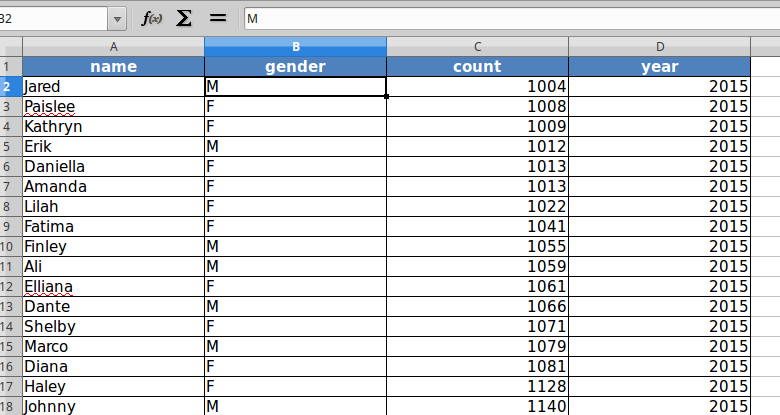
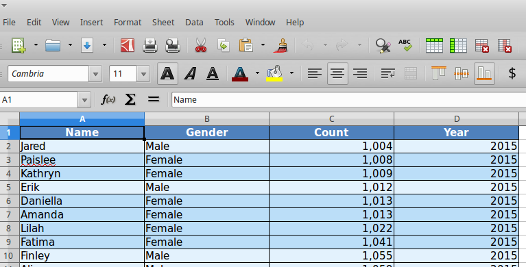
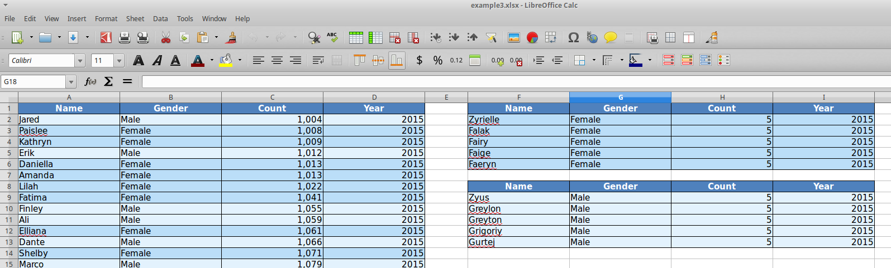
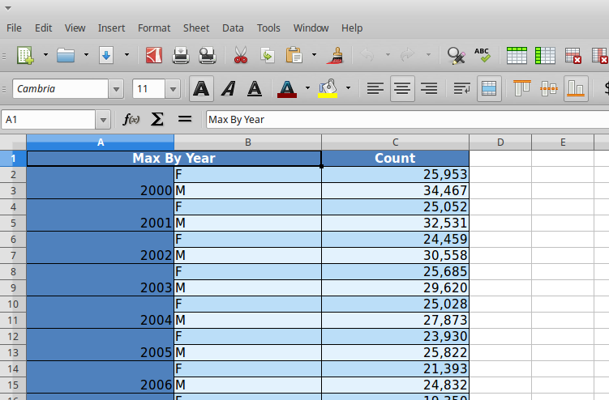

XLSX Examples
=============

This page provides a list of examples that demonstrate rendering xlsx output
from the given dataframe. Each example is self-contained inside
a class. We have some helper functions to provide the data we need for
this examples

Helper Functions (Data loading routines)
----------------------------------------

.. literalinclude:: xlsx_usage.py
   :linenos:
   :language: python
   :start-after: start_imports
   :end-before: end_imports

.. literalinclude:: xlsx_usage.py
   :linenos:
   :language: python
   :start-after: start_data_routine
   :end-before: end_data_routine

Example 1 - DataFrame with default styles
-------------------------------------------

Demonstrates converting dataframe into html format with default
styles.

.. literalinclude:: xlsx_usage.py
   :linenos:
   :language: python
   :start-after: start_XLSXExample1
   :end-before: end_XLSXExample1

Example 2 - DataFrame with custom styles
-----------------------------------------

In this example, we format the different components of dataframe with
various styling attributes

.. literalinclude:: xlsx_usage.py
   :linenos:
   :language: python
   :start-after: start_XLSXExample2
   :end-before: end_XLSXExample2

Example 3 - Simple DataFrame with Layouts
-------------------------------------------

Demonstrates rendering multi-dataframes in one worksheet along with
common functions for styling

.. literalinclude:: xlsx_usage.py
   :linenos:
   :language: python
   :start-after: start_XLSXExample3
   :end-before: end_XLSXExample3

Example 4 - DataFrames with Multi-hierarchical columns and indices
------------------------------------------------------------------

Demonstrates rendering dataframes with multi-hierarchical indices
and mult-hierarchical columns

.. literalinclude:: xlsx_usage.py
   :linenos:
   :language: python
   :start-after: start_XLSXExample4
   :end-before: end_XLSXExample4

